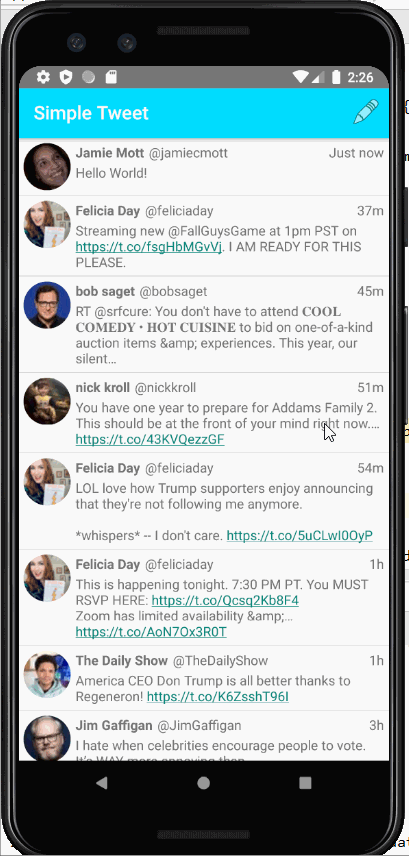
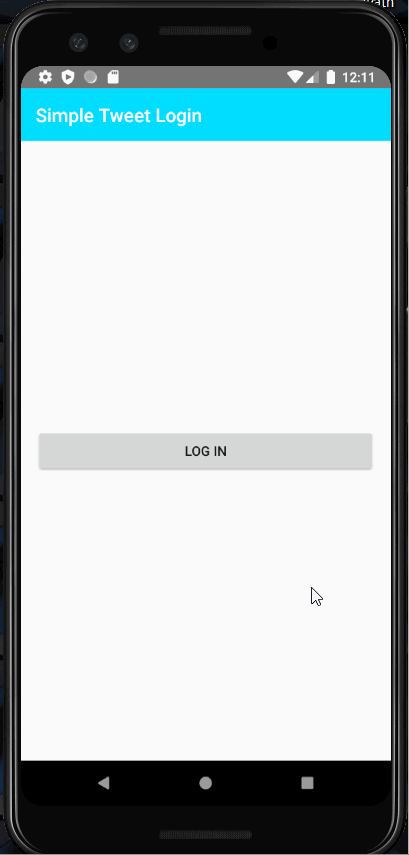

# Project 2 - *Simple Tweet - Part 2*

**Simple Tweet** is an android app that allows a user to view his Twitter timeline and post a new tweet. The app utilizes [Twitter REST API](https://dev.twitter.com/rest/public).

Time spent: **2** hours spent in total

## User Stories

The following **required** functionality is completed:

- [X] User can **compose and post a new tweet**
  - [X] User can click a “Compose” icon in the Action Bar on the top right
  - [X] User can then enter a new tweet and post this to twitter
  - [X] User is taken back to home timeline with **new tweet visible** in timeline
  - [X] Newly created tweet should be manually inserted into the timeline and not rely on a full refresh
  - [X] User can **see a counter with total number of characters left for tweet** on compose tweet page

The following **optional** features are implemented:

- [X] User is using **"Twitter branded" colors and styles**
- [X] User can **click a link within a tweet body** on tweet details view. The click will launch the web browser with relevant page opened.
- [ ] User can **select "reply" from detail view to respond to a tweet**
  - [ ] User that wrote the original tweet is **automatically "@" replied in compose**
- [X] User can move the "Compose" action to a FloatingActionButton instead of on the AppBar.
- [ ] Compose tweet functionality is build using modal overlay
- [X] Use Parcelable instead of Serializable using the popular [Parceler library](http://guides.codepath.org/android/Using-Parceler).
- [X] User can **open the twitter app offline and see last loaded tweets**. Persisted in SQLite tweets are refreshed on every application launch. While "live data" is displayed when app can get it from Twitter API, it is also saved for use in offline mode.
- [ ] When a user leaves the compose view without publishing and there is existing text, prompt to save or delete the draft. If saved, the draft should then be **persisted to disk** and can later be resumed from the compose view.
- [ ] User can enable app to **receive implicit intents** from other apps. When a link is shared from a web browser, it should pre-fill the text and title of the web page when composing a tweet.

The following **bonus** features are implemented:

- [X] User can tap a tweet to **open a detailed tweet view**
  - [ ] User can **take favorite (and unfavorite) or reweet** actions on a tweet
- [ ] Use the popular ButterKnife annotation library to reduce view boilerplate.
- [X] On the Twitter timeline, leverage the [CoordinatorLayout](http://guides.codepath.org/android/Handling-Scrolls-with-CoordinatorLayout#responding-to-scroll-events) to apply scrolling behavior that [hides / shows the toolbar](http://guides.codepath.org/android/Using-the-App-ToolBar#reacting-to-scroll).

The following **additional** features are implemented:

- [X] User is warned when tweet length is more than 280 by text turning red
- [X] Launcher icon updated to Twitter icon

## Video Walkthrough

Here's a walkthrough of implemented user stories:

GIF created with [LiceCap](http://www.cockos.com/licecap/).

## Notes

I spent a lot of time playing around with different layouts to get the styling I wanted.

## Open-source libraries used

- [Android Async HTTP](https://github.com/codepath/CPAsyncHttpClient) - Simple asynchronous HTTP requests with JSON parsing
- [Glide](https://github.com/bumptech/glide) - Image loading and caching library for Android

## License

    Copyright 2020 Jamie Mott

    Licensed under the Apache License, Version 2.0 (the "License");
    you may not use this file except in compliance with the License.
    You may obtain a copy of the License at

        http://www.apache.org/licenses/LICENSE-2.0

    Unless required by applicable law or agreed to in writing, software
    distributed under the License is distributed on an "AS IS" BASIS,
    WITHOUT WARRANTIES OR CONDITIONS OF ANY KIND, either express or implied.
    See the License for the specific language governing permissions and
    limitations under the License.

# Project 2 - *Simple Tweet - Part 1*

**Simple Tweet** is an android app that allows a user to view his Twitter timeline. The app utilizes [Twitter REST API](https://dev.twitter.com/rest/public).

Time spent: **10** hours spent in total

## User Stories

The following **required** functionality is completed:

- [X] User can **sign in to Twitter** using OAuth login
- [X]	User can **view tweets from their home timeline**
  - [X] User is displayed the username, name, and body for each tweet
  - [X] User is displayed the [relative timestamp](https://gist.github.com/nesquena/f786232f5ef72f6e10a7) for each tweet "8m", "7h"
- [X] User can refresh tweets timeline by pulling down to refresh

The following **optional** features are implemented:

- [X] User can view more tweets as they scroll with infinite pagination
- [ ] Improve the user interface and theme the app to feel "twitter branded"
- [X] Links in tweets are clickable and will launch the web browser
- [X] User can tap a tweet to display a "detailed" view of that tweet
- [ ] User can see embedded image media within the tweet detail view
- [ ] User can watch embedded video within the tweet
- [X] User can open the twitter app offline and see last loaded tweets
- [X] On the Twitter timeline, leverage the CoordinatorLayout to apply scrolling behavior that hides / shows the toolbar.

The following **additional** features are implemented:

- [X] I did not have time to fully match the colors and styles of Twitter, but I tried to match some.  For example, the detail view has a circle image and there is a guideline between each post in the timelime view.  I also added a toolbar with a functional "back" button to the detail view to match the Twitter set up.

## Video Walkthrough

Here's a walkthrough of implemented user stories:

GIF created with [LiceCap](http://www.cockos.com/licecap/).

## Notes

I had trouble getting set up with a Twitter Developer account for a bit.  Once that was squared away, I didn't have any real issues.

## Open-source libraries used

- [Android Async HTTP](https://github.com/codepath/CPAsyncHttpClient) - Simple asynchronous HTTP requests with JSON parsing
- [Glide](https://github.com/bumptech/glide) - Image loading and caching library for Android

## License

    Copyright: 2020 Jamie Mott

    Licensed under the Apache License, Version 2.0 (the "License");
    you may not use this file except in compliance with the License.
    You may obtain a copy of the License at

        http://www.apache.org/licenses/LICENSE-2.0

    Unless required by applicable law or agreed to in writing, software
    distributed under the License is distributed on an "AS IS" BASIS,
    WITHOUT WARRANTIES OR CONDITIONS OF ANY KIND, either express or implied.
    See the License for the specific language governing permissions and
    limitations under the License.
